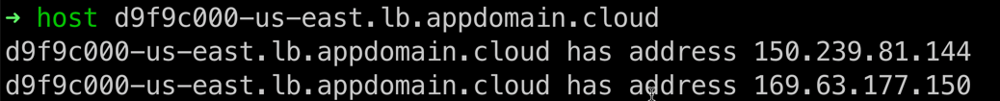

Exposing an OpenShift application to the Internet from a ‘private’ Satellite Cluster using a Load Balancer
===================================


**Kevin Collins ( kevincollins@us.ibm.com )**  
**Kunal Malhotra ( kunal.malhotra3@ibm.com )**

Let's say you have deployed a RedHat OpenShift Cluster via IBM Cloud
Satellite in a private isolated network in your datacenter and now you
have deployed certain applications on this OpenShift Cluster which are
required to be exposed to the public Internet. According to the current
design the only way it is possible to expose the application to the
public Internet is either you expose your whole satellite location to
the Internet or use networking infrastructure such as (load balancer,
http/https/TLS proxy etc.).

Exposing the whole satellite location brings up a huge security concern
i.e. anybody from the outside world can access you satellite control
plane in the datacenter or the OpenShift worker nodes themselves and
this is not ideal for any enterprise. Hence using networking
infrastructure make much more sense for both security and operational
points to expose applications to the Internet. This involves having a
networking device outside of the cluster and configuring the load
balancer to access a NodePort service on your OpenShift Cluster. Not
only will you find this method more secure, it also scales better. In
tutorial we will show you how to NAT the traffic coming from the
Internet to your internal private network via a load balancer so that
your application is accessible via the internet.

Note: This step-by-step tutorial have been performed on IBM Cloud, but
steps should be similar on other public cloud providers and on-prem.

Create a load balancer service with your cloud provider.
========================================================

**IBM Cloud Example:**

From the IBM Cloud menu, navigate to **VPC Infrastructure** and under
**Network**, select **Load Balancers**, and click **Create**.


Configure the Load Balancer
---------------------------

Give the load balancer a **name**, select **Application Load Balancer**,
select the **Region** where your satellite hosts are, select your
**virtual private cloud** your hosts are in, and finally select **all
subnets** for your VPC.


Create a backend pool
---------------------

In OpenShift, get the nodeport of the service you want to expose to the
Internet.

**Example to Test:**

Create a new openshift application

```
oc new-app openshift/hello-openshift
```

This creates a pod and a cluster ip service.

Edit the service, search for ClusterIP and change it to NodePort. Save
the service.

```
oc edit svc hello-openshift
```
Note the port of the service.


In this case, we want to create a load balancer for the service running
on port 8080 which maps to port 30268 in the cluster.

Create a backend pool
---------------------

Back on the create load balancer page, click on **New Pool** in the
backend pool section.


Following the above example, we will use the name hello-openshift and
for Health Port, but the port number we got in the previous step ... in
this case 30268.


**Attach Virtual Hosts to the Backend Pool.**

Under the backend pool section, click on **attach**.


On the next screen select the first subnet, and then select the first
worker node instance, and use the same port number ( 30268 in our case
). Click add and **repeat the same steps for every subnet and every
worker node** in the cluster.


\*Important note -- when you add or remove worker nodes in your cluster,
will need to go back to this backend pool and either add the new worker
node or remove it from this backend pool.

After entering all the worker nodes, they should all appear in attached
instances.


Create Front-end Listener
-------------------------

Under front-end listeners, click on **New listener**.


On the next screen, enter the node port from your service ( in the
example above 30280 ), select your backend pool, and then enter 15000 as
the maximum connections, and then click save.


Create the load balancer
------------------------

On the panel on the right hand side of the screen, click on Create Load
Balancer.


Get the load balancer host name
-------------------------------

The load balancer will take a few minutes to create. After it is
created, you can view the hostname from the overview page.


Test the load balancer
----------------------

If you are following the example in this document, you can curl the
hostname and it should tell you "Hello Openshift"


Note, it can take a couple of minutes for DNS to be updated. If you want
to test right away run

```
host \<hostname\>
```

This will return 2 IPs, like below that you can then curl instead of the
hostname if you want to test right away.


